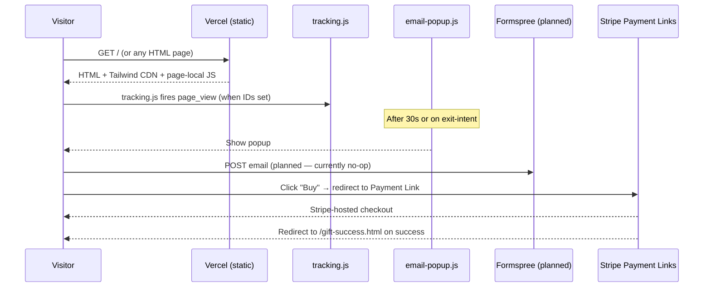

# Architecture

HerRelief is a static storefront with one external dependency (Stripe) and
zero backend. This doc covers how that minimal surface is organised and what
each piece is responsible for.

---

## Overview

The whole site is content + static JS + three outbound links. No serverless
functions, no database, no auth.

---

## Subsystems

### 1. Storefront pages

Nineteen HTML files. Each is self-contained — head metadata, JSON-LD,
nav, content, footer, and inline `<script>` blocks. The deliberate cost is
duplication; the benefit is that any page can be opened, audited, and edited
in isolation.

Pages by role:

| Role | Files |
|---|---|
| Conversion funnel | `index.html`, `product.html`, `cart.html` |
| Trust & proof | `science.html`, `about.html`, `tiktok-section.html` |
| Lead magnet | `cycle-wellness-toolkit.html`, `gift-success.html` |
| Compliance | `refund-policy.html`, `shipping-policy.html`, `privacy-policy.html`, `terms.html` |
| Misc / internal | `presentation.html`, `logos.html`, `style-demos-{1,2}.html`, `profile-pic.html`, `404.html`, `contact.html` |

### 2. Checkout (Stripe Payment Links)

No SDK. Three hard-coded `https://buy.stripe.com/...` URLs power "Buy" buttons
on `product.html` and `cart.html`:

| Bundle | Stripe Payment Link |
|---|---|
| Single | `buy.stripe.com/00wfZaczCgjA9Yp5pQ3F60j` |
| Double | `buy.stripe.com/aFadR28jm2sKc6x2dE3F60g` |
| Triple | `buy.stripe.com/5kQbIUdDGffw5I9dWm3F60k` |

Stripe handles cart UI, taxes, shipping address, payment methods, fraud, and
confirmation emails. The site handles browsing.

### 3. Email capture (`email-popup.js`)

Vanilla JS. Self-instantiating IIFE. Two triggers (`mouseleave` with
`clientY <= 0` for exit-intent, OR a 30-second timer). One trigger wins per
session — `sessionStorage` prevents re-showing. DOM is constructed in JS,
not in the page (so the popup never flashes during page load).

The form's submit handler POSTs to `FORM_ACTION` — currently a Formspree
placeholder. Wiring a real endpoint is a one-line change.

### 4. Analytics (`tracking.js`)

Pluggable shim. Named constants at the top of the file
(`GA4_ID`, `CLARITY_ID`, `TIKTOK_PIXEL_ID`) all default to placeholder
strings. The shim guards every emit with `if (id !== 'PLACEHOLDER')` so
shipping it doesn't accidentally double-track or fire to a wrong property.

Tracked events:
- Page view (every page load)
- "Buy" button click (`begin_checkout` per GA4 spec, with bundle name)
- Popup show / dismiss / submit
- Outbound to Stripe

### 5. Before/after slider (`js/before-after.js`)

Used on the home and product pages to compare cramps pose vs relief pose.
Pure JS — `mousemove` / `touchmove` listeners on a clip-path mask.

### 6. Schema.org structured data

JSON-LD blocks in `<head>` per page:

| Page | Schemas |
|---|---|
| `index.html` | Organization, WebSite, BreadcrumbList |
| `product.html` | Product |

These make the site eligible for Google Shopping Graph and rich-snippet
search results.

---

## Data flow

There is no data flow inside the site. Three flows leave it:

1. **Stripe** — outbound click → hosted checkout → order in the Stripe
   dashboard. Confirmation email comes from Stripe.
2. **Formspree** *(planned)* — outbound POST from email popup → Formspree
   inbox. Currently a no-op because `FORM_ACTION` is a placeholder.
3. **Analytics** *(planned)* — GA4 / Clarity / TikTok pixel beacons emit
   from `tracking.js` once real IDs are pasted in.

Order data, customer data, and revenue all live in Stripe.

---

## Deployment topology

- **Vercel** static project (`heatrelief-pro`). Auto-deploys on push to `main`.
- **Hero video** served from the same Vercel origin (the 950 KB MP4 ships
  inside the deploy). It compresses well over HTTP/2 and avoids a third-party
  video host.
- **Fonts** loaded from Google Fonts CDN.
- **Tailwind CSS** loaded from the Tailwind CDN, compiles in-browser per
  page load.
- **Stripe checkout** is on Stripe's domain — no PCI scope on this site.

No Vercel functions are deployed; `vercel.json` is empty.

---

## Security

What's there today:

- **No backend means no auth, no sessions, no API endpoints to exploit.**
- **Stripe-hosted checkout** keeps payment data out of the site's scope
  entirely.
- **No user input is processed** by the site itself — the contact and popup
  forms POST to third parties (planned).

What's missing (see Roadmap):

- `vercel.json` is empty. No `Content-Security-Policy`, no `Strict-Transport-Security`,
  no `X-Frame-Options`, no `X-Content-Type-Options`, no `Referrer-Policy`,
  no `Permissions-Policy`. These should all be added — they're free, and a
  reviewer will look.
- The Tailwind CDN executes scripts in the page. With a CSP, this is the
  source that has to be allowed; document the decision in the header.

---

## Performance considerations

- **No JS framework** keeps total JS minimal. Per-page JS is a few KB
  (`tracking.js` ~10 KB, `email-popup.js` ~13 KB) plus the Tailwind runtime.
- **Hero video pre-optimised** (web-encoded MP4, autoplay-muted, playsinline)
  so it satisfies iOS Safari autoplay rules without flash.
- **Lazy-loaded images**: gallery images use `loading="lazy"` so the only
  paint cost on first scroll is the hero.
- **Critical CSS not extracted**. Tailwind CDN compiles on-load. First paint
  shows unstyled text for ~50-150 ms on slow connections. A static
  `tailwindcss build` would remove this.

---

## Future work

In rough priority order:

1. **Harden `vercel.json` headers**. Add CSP (allow Tailwind CDN +
   Google Fonts + Stripe + Formspree), HSTS, X-Frame-Options DENY,
   X-Content-Type-Options nosniff, Referrer-Policy strict-origin-when-cross-origin,
   Permissions-Policy locking camera/mic/geo. ~30 lines of JSON, high reward.

2. **Wire the email popup endpoint**. Either a real Formspree URL or a
   single `api/email.js` Vercel function that POSTs to a Google Apps
   Script / Sheet sink (low-cost CRM). Same for `contact.html`.

3. **Run `tailwindcss build`**. One-time build step that generates a
   page-specific minified CSS file per HTML page, removes the runtime
   compiler, and probably halves first-paint time on 3G.

4. **Template the shared chrome**. Extract nav and footer into a `_nav.html`
   / `_footer.html`, write a 20-line Node script that injects them into each
   page during build. Cuts maintenance cost across 19 pages.

5. **Real analytics IDs**. Paste GA4 + Clarity + TikTok pixel IDs into
   `tracking.js`. Begin the funnel-tuning loop.

6. **Add `cleanUrls`**. One line in `vercel.json`: `"cleanUrls": true`.
   `/product` instead of `/product.html`.

7. **Light A/B framework**. A JSON config loaded at boot (`/experiments.json`)
   that flips copy variants on the hero and the popup. No new deps; just
   a tiny `data-experiment` attribute system.

8. **Move from three Payment Links to Stripe Checkout Sessions**. Once a
   second SKU or a subscription is on the roadmap. Adds one Vercel function
   (`api/create-checkout.js`) and lets you compute bundle prices server-side
   for A/B pricing.
